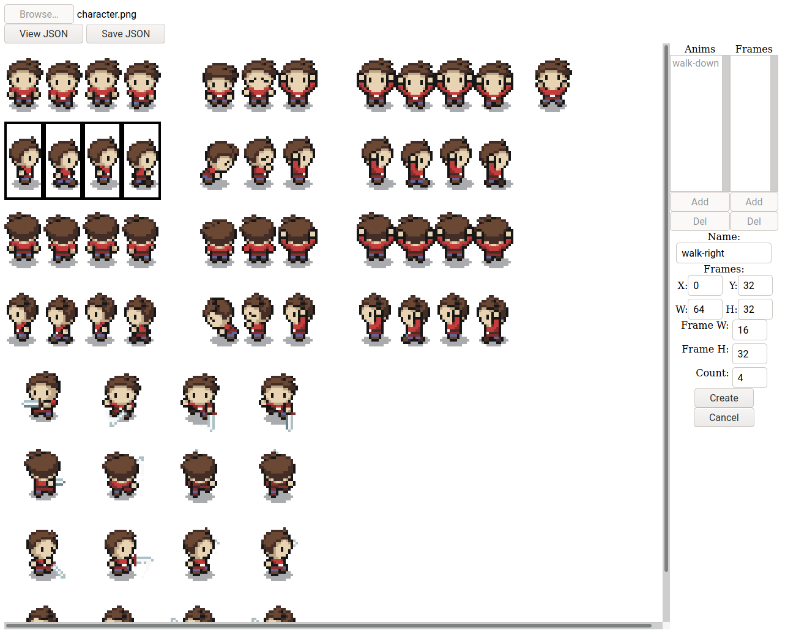

# sprite-sheet-to-json

A simple HTML5/CSS/JavaScript based tool to create texture atlas JSON hashes from sprite sheet images.

<div align="center">
  
</div>

_Written in Typescript and bundled for the web with Rollup._

## Usage

### Online

Visit https://asyed94.github.io/sprite-sheet-to-json.

### Offline

Clone this repository and install its dependencies:

```bash
git clone https://github.com/asyed94/sprite-sheet-to-json
cd sprite-sheet-to-json
npm install
```

`npm start` launches a server, using [serve](https://github.com/zeit/serve). Navigate to [localhost:3000](http://localhost:3000).

`npm run build` builds the application to `public/bundle.js`, along with a sourcemap file for debugging.

`npm run watch` will continually rebuild the application as your source files change.

`npm run dev` will run `npm start` and `npm run watch` in parallel.

## License

[ISC](LICENSE).
